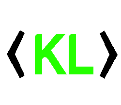
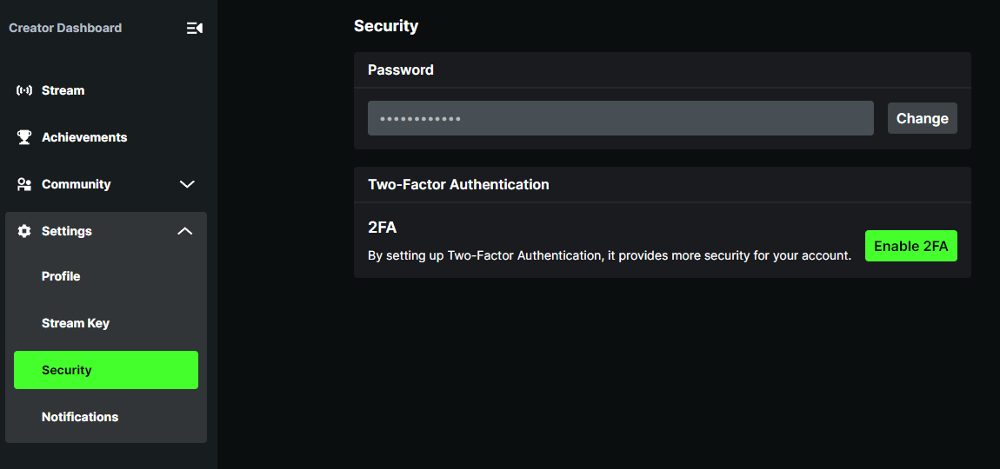
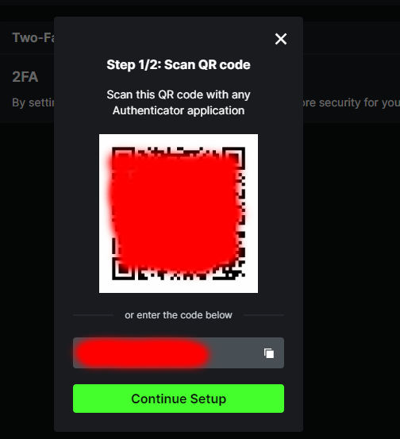

<p align="center"> 

</p>


<p align="center">
<a href="https://www.microsoft.com/net"></a>
<a href="https://www.microsoft.com/net"></a>
<a href="https://www.microsoft.com/net"></a>
<a href="https://www.microsoft.com/net"></a>⎮
<a href="https://discord.gg/fPRXy57WrS"></a>
<a href="https://github.com/Bukk94/KickLib/blob/master/LICENSE"></a>
<a href="https://www.nuget.org/packages/KickLib"></a>
</p>

<p align="center">
  <a href='https://ko-fi.com/bukk94' target='_blank'>
  
</a>

# About

KickLib.Unofficial is a C# library that allows for interaction with unofficial (undocumented/private) Kick API (https://kick.com) 
 and WebSocket. KickLib eases implementation for various chatbots by providing simple to use methods.

## KickLib Unofficial Highlights ✨

* Real-time chat reading
* Stream state detection
* Authentication flow
* Message sending
* API Endpoint calls

<details>
<summary>Click here to see Complete Features List</summary>

### Client
* Reading Chatroom events
  * New message received
  * Message deleted
  * User banned / unbanned
  * New subscriptions
  * Subscriptions gifts
  * Stream host changes
  * New pinned message
  * Pinned message deleted
* Reading Channel events 
  * Followers status updated
  * Stream state detection
  * Gifts leaderboards updated

### API
* Categories
  * Get all main (root) categories
  * Get specific main category
  * Get top categories
  * Get sub-categories (paged)
  * Get all sub-categories (list all)
  * Get specific sub-category
  * Get subcategory clips (paged)
* Clips
  * Get all Kick clips
  * Get clip information
  * Download clip
* Channels
  * Get messages
  * Get channel information
  * Get channel chatroom information
  * Get channel chatroom rules
  * Get channel polls
  * Get channel clips
  * Get channel links
  * Get channel videos
  * Get channel latest video
  * Get channel leaderboards
  * Get latest subscriber (Requires Authentication)
  * Get followers count
* Emotes
  * Get channel emotes
* Livestreams
  * Is streamer live?
  * Get livestream information 
* Message
  * Send message to chatroom (Requires Authentication)
* Users
  * Get user information
* Videos
  * Get video
</details>

## Installing ⏫

First, [install NuGet](http://docs.nuget.org/docs/start-here/installing-nuget). 
Then, install [KickLib](https://www.nuget.org/packages/KickLib) from the package manager console:

```
PM> Install-Package KickLib
```
Or from the .NET CLI as:
```
dotnet add package KickLib
```

### Using KickLib via Dependency Injection

If you are using Dependency Injection, you can easily add KickLib via extension method 
`.AddUnofficialKickLib()`, that will register all related services with Scoped lifetime.

Additionally, you need to either register your own client or use prepared builders like `.WithPuppeteerClient()`.

```csharp
serviceCollection
  .AddKickLib()
  .WithPuppeteerClient();
```

## Examples 💡

### Using API to get information
```csharp
IUnofficialKickApi kickApi = new KickUnofficialApi();

var userName = "channelUsername";

// Get information about user
var user = await kickApi.Users.GetUserAsync(userName);

// Get information about channel
var channelInfo = await kickApi.Channels.GetChannelInfoAsync(userName);

// Gets detailed information about current livestream
var liveInfo = await kickApi.Livestream.GetLivestreamInfoAsync(userName);

// Get clips
var channelClips = await kickApi.Clips.GetClipsAsync();
```

### Using `Cursor` to page data

Using following example you can retrieve history messages from channel's chat.
```
IUnofficialKickApi kickApi = new KickUnofficialApi();
var channelInfo = await kickApi.Channels.GetChannelInfoAsync("channelUsername");
var channelId = channelInfo.Id;

KickLib.Models.Response.v2.Channels.Messages.MessagesResponse response = null;
do
{
    response = await kickApi.Channels.GetChannelMessagesAsync(90876, response?.Cursor);
    // Process page response
} while (response.Cursor != null);
```

To get real-time messages, use `IKickClient` (example below).

### Using Client to read chat messages

```csharp
IKickClient client = new KickClient();

client.OnMessage += delegate(object sender, ChatMessageEventArgs e)
{
    Console.WriteLine(e.Data.Content);
};

await client.ListenToChatRoomAsync(123456);
await client.ConnectAsync();
```

### Authenticated API calls

Authenticated calls are tricky as there is no official authentication flow for Unofficial/Private API. 
Currently, authenticated API calls can be done only by enabling 2FA and providing
login credentials and 2FA authorization code.

Step 1: Go to Security settings page on your account:
[https://kick.com/dashboard/settings/security](https://kick.com/dashboard/settings/security)


Step 2: Click `Enable 2FA`. If you already have 2FA enabled, you will need to remove it and add it again.



Step 3: Copy authentication code show on the screen. Usually in following format:
`A123BCDEFGIJFKLM`. You need to save this code! You can't view it again after you finish setup.

Step 4: Finalize 2FA setup using Authentication app of your choice.

Step 5: You're done! Now you can use Authorization code in KickLib to generate correct TOTP tokens.

```csharp
IUnofficialKickApi kickApi = new KickUnofficialApi();
var authSettings = new AuthenticationSettings("username", "password")
{
    TwoFactorAuthCode = "A123BCDEFGIJFKLM"
};
    
await kickApi.AuthenticateAsync(authSettings);
await kickApi.Messages.SendMessageAsync(123456, "My message");
```

## Custom downloader client

If you are not satisfied with provided client, you can implement your own download logic. 
All you need to do is implement `IApiCaller` interface and pass new instance to `KickApi`.

```csharp
public class MyOwnDownloader : IApiCaller 
{
    // Implementation
}
```
```csharp
var myDownloader = new MyOwnDownloader();
IUnofficialKickApi kickApi = new KickUnofficialApi(myDownloader);
```

# Disclaimer

This Unofficial part of library is deprecated and serves as a reference for future development.

It is advised to use official API for all interactions with Kick platform.

KickLib is meant to be used for education purposes. Don't use it for heavy scraping or other harmful actions against
Kick streaming platform. I don't take responsibility for any KickLib misuse and I strongly advice against such actions.

# License

See [MIT License](../LICENSE).