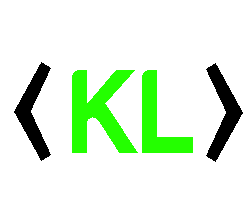

<p align="center"> 

</p>

<p align="center">
<a href="https://www.microsoft.com/net"></a>
<a href="https://www.microsoft.com/net"></a>
<a href="https://www.microsoft.com/net"></a>
<a href="https://www.microsoft.com/net"></a>⎮
<a href="https://discord.gg/fPRXy57WrS"></a>
<a href="https://github.com/Bukk94/KickLib/blob/master/LICENSE"></a>
<a href="https://www.nuget.org/packages/KickLib"></a>
</p>

<p align="center">
  <a href='https://ko-fi.com/bukk94' target='_blank'>
  
</a>

# About

KickLib is a C# library that allows for interaction with both official and unofficial (undocumented) Kick API (https://kick.com) 
 and WebSocket (pusher). KickLib eases implementation for various chatbots by providing simple to use methods.

## KickLib Highlights ✨

* OAuth 2.1 flow
* Real-time chat reading
* Stream state detection
* Authentication flow
* Webhook payload parsing
* Message sending
* Official and unofficial API endpoints

<details>
<summary>Click here to see Complete Features List</summary>

### Client
* Reading Chatroom events
  * New message received
  * Message deleted
  * User banned / unbanned
  * New subscriptions
  * Subscriptions gifts
  * Stream host changes
  * New pinned message
  * Pinned message deleted
* Reading Channel events 
  * Followers status updated
  * Stream state detection
  * Gifts leaderboards updated

### API
* Categories
  * Get all main (root) categories
  * Get specific main category
  * Get top categories
  * Get sub-categories (paged)
  * Get all sub-categories (list all)
  * Get specific sub-category
  * Get subcategory clips (paged)
* Clips
  * Get all Kick clips
  * Get clip information
  * Download clip
* Channels
  * Get messages
  * Get channel information
  * Get channel chatroom information
  * Get channel chatroom rules
  * Get channel polls
  * Get channel clips
  * Get channel links
  * Get channel videos
  * Get channel latest video
  * Get channel leaderboards
  * Get latest subscriber (Requires Authentication)
  * Get followers count
* Emotes
  * Get channel emotes
* Livestreams
  * Is streamer live?
  * Get livestream information 
* Message
  * Send message to chatroom (Requires Authentication)
* Users
  * Get user information
* Videos
  * Get video
</details>

## Unofficial API support

KickLib provides support for unofficial API calls via `IKickUnofficialApi` and `IKickClient` interfaces.
Documentation for unofficial API can be found [here](KickLib.Api.Unofficial/README_UnofficialAPI.md).

## Installing ⏫

First, [install NuGet](http://docs.nuget.org/docs/start-here/installing-nuget). 
Then, install [KickLib](https://www.nuget.org/packages/KickLib) from the package manager console:

```
PM> Install-Package KickLib
```
Or from the .NET CLI as:
```
dotnet add package KickLib
```

### Using KickLib via Dependency Injection

If you are using Dependency Injection, you can easily add KickLib via extension method 
`.AddKickLib()`, that will register all related services with Scoped lifetime.

## Examples 💡

To see complex examples you can copy-out, check out [KickLib Examples folder](Examples):
- [API Examples](Examples/KickApiExample.cs)
- [Unofficial API Examples](Examples/UnofficialApiExample.cs)
- [Client Examples](Examples/KickClientExample.cs)

### OAuth flow / Authenticated API calls

Almost all calls requires authentication. Kick officially supports OAuth 2.1 flow.
KickLib provides tools for generating OAuth URLs, exchanging code for tokens, and refreshing tokens.

> NOTE: If no state is provided, it will automatically generate state for you as base64 encoded verifier code! 

```csharp
var callbackUrl = "https://localhost:5001/auth/kick/callback"; 
var clientId = "01AAAAA0EXAMPLE66YG2HD9R";
var clientSecret = "aaac0000EXAMPLE8ebe4dc223d0c45187";
var authGenerator = new KickOAuthGenerator();

var url = authGenerator.GetAuthorizationUri(
  callbackUrl, 
  clientId, 
  new List<string>
  {
      KickScopes.UserRead,
      KickScopes.ChannelWrite
  }, out var verifier);

// TODO: Perform URL redirect for the user and pass OAuth process
// By using callback URL, you will receive code and state, which can be used for Token exchange.
 
var code = "NAAAAAAY5YZQ00STATE000ZZTFHM2I1NJLK";
var state = "ZXhhbXBsZSB2YWx1ZQ=="; 
var exchangeResults = await authGenerator.ExchangeCodeForTokenAsync(
    code,
    clientId,
    clientSecret,
    callbackUrl,
    state);
        
if (exchangeResults.IsSuccess)
{
    Console.WriteLine($"Access Token: {exchangeResults.Value.AccessToken}");
    Console.WriteLine($"Refresh Token: {exchangeResults.Value.RefreshToken}");
    // TODO: Store access and refresh token for further use
    // Keep in mind: Access token is short lived, while refresh token is long lived (and should be stored)
}
```

### Refreshing Access Token

```csharp
var clientId = "01AAAAA0EXAMPLE66YG2HD9R";
var clientSecret = "aaac0000EXAMPLE8ebe4dc223d0c45187";
var refreshToken = "NAAAAAAY5YZQ00REFRESHTOKEN000ZZTFHM2I1NJLK";
var authGenerator = new KickOAuthGenerator();

var exchangeResults = await authGenerator.RefreshAccessTokenAsync(
    refreshToken,
    clientId,
    clientSecret);

// After every successful refresh, you will receive new access and refresh tokens
if (exchangeResults.IsSuccess)
{
    Console.WriteLine($"Access Token: {exchangeResults.Value.AccessToken}");
    Console.WriteLine($"Refresh Token: {exchangeResults.Value.RefreshToken}");
}
```

### Using API to get category details
```csharp
var api = KickApi.Create();
var accessToken = "XXXXXXXXXX";

// Get specific category by ID
var category = await api.Categories.GetCategoryAsync(28, accessToken);
```

### Sending a chat message
```csharp
var settings = new ApiSettings
{
    RefreshToken = "ZZZZZZZZZZZZZZZZ",
    ClientId = "XXXXXX",
    ClientSecret = "YYYYYYYYYYYYYY"
};

var api = KickApi.Create(settings);
var channelInfo = await api.Channels.GetChannelAsync("foo");
var broadcasterId = channelInfo.Value.BroadcasterUserId;
await api.Chat.SendMessageAsUserAsync(broadcasterId, "Hello World");
```

### Subscribing to webhook events

To subscribe to events (reading chat messages or channel follow events),
you must first have **public** webhook URL set up in your [Kick settings](https://kick.com/settings/developer),
have webhooks enabled in your developer account, and lastly, your access token must
contain webhook scope (`KickScopes.EventsSubscribe`).

```csharp
var api = KickApi.Create(new ApiSettings
{
    AccessToken = "XXXXXXXXXX"
});

// Subscript to events (webhooks) for chat messages and channel follow events
var result = await api.EventSubscriptions.SubscribeToEventsAsync(
  new List<EventType> 
  { 
    EventType.ChatMessageSent,
    EventType.ChannelFollowed
  });
  
// Each event will be assigned own SubscriptionId
// Events will be delivered to your **public** webhook URL (set up in [Kick settings](https://kick.com/settings/developer)).
```

This will subscribe to selected events. Once those events are triggered, Kick will send
them to your webhook URL. You can then use `KickWebhookParser` to validate and parse the payload.

You should always validate the payload signature to ensure the webhook payload is really coming from Kick.

Kick will retry sending the webhook 3 times, until 200 response is made by your server.
If your server is unreachable or non-OK response is returned, Kick automatically unsubscribe the event!

### Automatically refreshing access token

KickLib allows automatic access token refresh. When RefreshToken, ClientId, and ClientSecret are provided,
KickLib will automatically try to refresh access token when needed.

```csharp
var settings = new ApiSettings
{
    RefreshToken = "XXXXXXXXXXXXXXXX",
    ClientId = "YYYYYYYYYYYYYYYY",
    ClientSecret = "ZZZZZZZZZZZZZZZZ"
};

settings.RefreshTokenChanged += (sender, args) =>
{
    Console.WriteLine($"Refresh token changed! New value: {args.NewToken}");
};

settings.AccessTokenChanged += (sender, args) =>
{
    Console.WriteLine($"Access token changed! New value: {args.NewToken}");
};

var api = KickApi.Create(settings);
// TODO: use `api` for calling endpoints
```

> Keep in mind that refreshing access token also changes the refresh token!
> KickLib is automatically refreshing those and will notify you via `RefreshTokenChanged` event.
> But you need to make sure you are storing the new refresh token for further use.

### Using Client to read chat messages

> This is using Kick's undocumented (unofficial) pusher! IDs and values **may** differ from official API.

```csharp
IKickClient client = new KickClient();
var chatroomId = 123456; // This ID can be obtained by using IUnofficialKickApi or by manually extracting from web netwowk tab.

client.OnMessage += delegate(object sender, ChatMessageEventArgs e)
{
    Console.WriteLine($"Received message: {e.Data.Content}");
};

await client.ListenToChatRoomAsync(chatroomId);
await client.ConnectAsync();

// TODO: Make sure this is in endless loop and program won't exit immediately
// otherwise you won't be able to receive messages.
```

## Testing Webhooks

If you don't have a server set up to receive webhooks but want to test the payloads sent by Kick, you can use a service like [Webhook.site](https://webhook.site/).

# Disclaimer

For a long time, Kick didn't have any official API.
Most of the functionality in KickLib was researched and reversed-engineered from their website.

With new released API support, this library will be adjusted accordingly, removing all unofficial endpoints and methods.
Those methods will be replaced with proper official API calls (once we have all of them).

KickLib is meant to be used for education purposes. Don't use it for heavy scraping or other harmful actions against
Kick streaming platform. I don't take responsibility for any KickLib misuse and I strongly advice against such actions.

# Special Thanks

* @Robertsmania for helping with OTP generation, library improvements, and extensive testing.
* All contributors for their help, PRs, suggestions, and bug reports.

# License

See [MIT License](LICENSE).