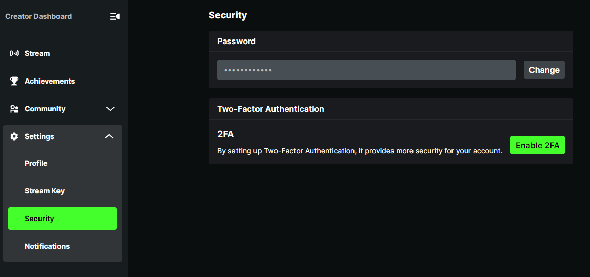
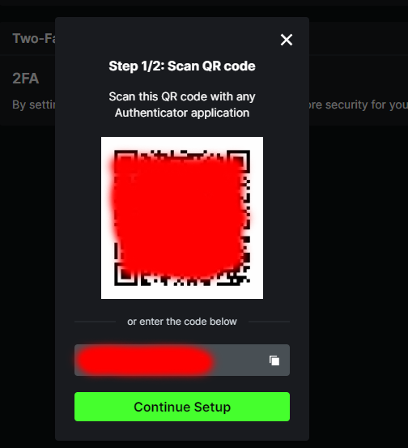

<p align="center"> 

</p>

<p align="center">
<a href="https://www.microsoft.com/net"></a>

<a href="https://discord.gg/fPRXy57WrS"></a>
<a href="https://github.com/Bukk94/KickLib/blob/master/LICENSE"></a>
<a href="https://www.nuget.org/packages/KickLib"></a>
</p>

<p align="center">
  <a href='https://ko-fi.com/fusedchat' target='_blank'>
  
</a>

# About

KickLib is a C# library that allows for interaction with unofficial / undocumented Kick API (https://kick.com) 
 and WebSocket. KickLib eases implementation for various chatbots by providing simple to use methods.

## KickLib Highlights ✨
* Real-time chat reading
* Stream state detection
* Authentication flow
* Message sending
* API Endpoint calls

<details>
<summary>Click here to see Complete Features List</summary>

### Client
* Reading Chat Messages
* Reading Channel events 
  * Follows status updated
  * Stream state detection

### API
* Categories
  * Get all main (root) categories
  * Get specific main category
  * Get top categories
  * Get sub-categories (paged)
  * Get all sub-categories (list all)
  * Get specific sub-category
  * Get subcategory clips (paged)
* Clips
  * Get all Kick clips
  * Get clip information
  * Download clip
* Channels
  * Get messages
  * Get channel information
  * Get channel chatroom information
  * Get channel clips
  * Get channel links
  * Get latest subscriber (Requires Authentication)
  * Get followers count
* Emotes
  * Get channel emotes
* Livestreams
  * Is streamer live?
  * Get livestream information 
* Message
  * Send message to chatroom (Requires Authentication)
* Users
  * Get user information
</details>

## Installing ⏫

First, [install NuGet](http://docs.nuget.org/docs/start-here/installing-nuget). 
Then, install [KickLib](https://www.nuget.org/packages/KickLib) from the package manager console:

```
PM> Install-Package KickLib
```
Or from the .NET CLI as:
```
dotnet add package KickLib
```

### Using KickLib via Dependency Injection

If you are using Dependency Injection, you can easily add KickLib via extension method 
`.AddKickLib()`, that will register all related services with Scoped lifetime.

Then you need to either register your own `BrowserSettings` or use `.AddKickLibSettings()`.

```csharp
serviceCollection
   .AddKickLib()
   .AddKickLibSettings();
```

## Examples 💡

### Using API to get information
```csharp
IKickApi kickApi = new KickApi();

var userName = "channelUsername";

// Get information about user
var user = await kickApi.Users.GetUserAsync(userName);

// Get information about channel
var channelInfo = await kickApi.Channels.GetChannelInfoAsync(userName);

// Gets detailed information about current livestream
var liveInfo = await kickApi.Livestream.GetLivestreamInfoAsync(userName);

// Get clips
var channelClips = await kickApi.Clips.GetClipsAsync();
```

### Using `Cursor` to page data

Using following example you can retrieve history messages from channel's chat.
```
IKickApi kickApi = new KickApi();
var channelInfo = await kickApi.Channels.GetChannelInfoAsync("channelUsername");
var channelId = channelInfo.Id;

KickLib.Models.Response.v2.Channels.Messages.MessagesResponse response = null;
do
{
    response = await kickApi.Channels.GetChannelMessagesAsync(90876, response?.Cursor);
    // Process page response
} while (response.Cursor != null);
```

To get real-time messages, use `IKickClient` (example below).

### Using Client to read chat messages

```csharp
IKickClient client = new KickClient();

client.OnMessage += delegate(object sender, ChatMessageEventArgs e)
{
    Console.WriteLine(e.Data.Content);
};

await client.ListenToChatRoomAsync(123456);
await client.ConnectAsync();
```

### Authenticated API calls

Authenticated calls are tricky as there is no official authentication flow. 
Currently, authenticated API calls can be done only by enabling 2FA and providing
login credentials and 2FA authorization code.

Step 1: Go to Security settings page on your account:
[https://kick.com/dashboard/settings/security](https://kick.com/dashboard/settings/security)


Step 2: Click `Enable 2FA`. If you already have 2FA enabled, you will need to remove it and add it again.



Step 3: Copy authentication code show on the screen. Usually in following format:
`A123BCDEFGIJFKLM`. You need to save this code! You can't view it again after you finish setup.

Step 4: Finalize 2FA setup using Authentication app of your choice.

Step 5: You're done! Now you can use Authorization code in KickLib to generate correct TOTP tokens.

```csharp
IKickApi kickApi = new KickApi();
var authSettings = new AuthenticationSettings("username", "password")
{
    TwoFactorAuthCode = "A123BCDEFGIJFKLM"
};
    
await kickApi.AuthenticateAsync(authSettings);
await kickApi.Messages.SendMessageAsync(123456, "My message");
```

## Custom downloader client

If you are not satisfied with provided client, you can implement your own download logic. 
All you need to do is implement `IApiCaller` interface and pass new instance to `KickApi`.

```csharp
public class MyOwnDownloader : IApiCaller 
{
    // Implementation
}
```
```csharp
var myDownloader = new MyOwnDownloader();
IKickApi kickApi = new KickApi(myDownloader);
```

# Disclaimer

Kick don't have any official API. All functionality in KickLib was researched and reversed-engineered from their website.
This means that any API can change without announce.

KickLib is meant to be used for education purposes. Don't use it for heavy scraping or other harmful actions against
Kick streaming platform. I don't take responsibility for any KickLib misuse and I strongly advice against such actions.

Once API is officially released, this library will be adjusted accordingly.

# Special Thanks

@Robertsmania for helping with OTP generation and library improvements

# License

See [MIT License](LICENSE).